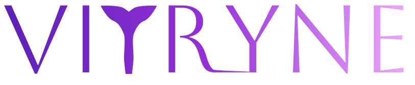

    

        
    

    

        
    

    <h1>A moda da sua região, na palma da sua mão.</h1>
    

        Marketplace que conecta consumidores a lojas físicas de moda da sua região   com catálogo digital, busca por proximidade, pagamento integrado e delivery.
    

     
    
     

    <a href="#sobre">Sobre</a> ·
    <a href="#produto">Produto</a> ·
    <a href="#arquitetura">Arquitetura</a> ·
    <a href="#stack">Stack</a> ·
    <a href="#time">Time</a>

---

## Sobre

O **Vitryne** é uma plataforma de marketplace regional de moda desenvolvida como um projeto para **Escola de TI**.

A ideia é simples: pequenas lojas de moda têm produtos incríveis, mas quase nenhuma presença digital. O Vitryne resolve isso entregando uma vitrine digital completa para o lojista e uma experiência de compra local com delivery, para o consumidor.

> Pensa no iFood mas para as lojas de roupa da sua cidade.

- 🏪 **Invisibilidade local** — lojas sem presença digital perdem vendas para grandes marketplaces todos os dias
- 📦 **Fretes e impostos** — consumidores pagam caro importando quando há opções equivalentes perto de casa
- 🔍 **Falta de centralização** — não existe plataforma regional com busca inteligente, delivery e devolução integrada

## Produto

### Para o consumidor

Descobrir lojas de moda da sua região, comprar em poucos toques, receber em casa.
Se a peça não servir, devolução sem fricção: pedimos, retiramos, reembolsamos.

### Para o lojista

Vitrine digital que cuida da exposição, do pedido e da logística. O lojista cuida
do que faz de melhor: curar produtos e atender bem. A gente cuida do resto.

### Para o entregador

Trabalho próximo, rotas curtas, ganhos transparentes. Coletas em lojas locais
e entregas no mesmo bairro — sem virar a cidade inteira por uma corrida.

## Arquitetura

O Vitryne é distribuído em quatro repositórios independentes, organizados por
responsabilidade de produto:

| Repositório | Plataforma | Público |
|---|---|---|
| [`vitryne-backend`](https://github.com/vitryne/vitryne-backend) | API REST | Servidor — regras de negócio, dados, integrações |
| [`vitryne-web`](https://github.com/vitryne/vitryne-web) | Web | Consumidor, lojista (portal), administrador |
| [`vitryne-mobile`](https://github.com/vitryne/vitryne-mobile) | iOS · Android | Consumidor, entregador |
| [`vitryne-docs`](https://github.com/vitryne/vitryne-docs) | Documentação | Arquitetura, requisitos, fluxos, ADRs |

## Stack

Construído com tecnologias modernas, escaláveis e amplamente adotadas pelo mercado.

  

**Back-end** — Java 17 · Spring Boot 3 · Spring Security · PostgreSQL · Redis · WebSocket · Docker
**Front-end Web** — React · TypeScript · Vite
**Mobile** — React Native · Expo · TypeScript
**Integrações** — Mercado Pago · Google Maps · Firebase Cloud Messaging
**DevOps** — Docker · GitHub Actions

## Identidade

  

A identidade do Vitryne é composta por um wordmark serifado e um ícone que usa
a letra **"T"** como silhueta de manequim — uma alusão direta à vitrine física,
que é o ponto de partida do produto.

## Time

O Vitryne é construído por uma equipe multidisciplinar de seis pessoas:

| | Nome | Função |
|---|---|---|
| | **Hugo Zuin** | Co-fundador · Engenharia |
| | **Bruno Abrahim** | Co-fundador · Engenharia |
| | **Gabriel Rodrigues** | Engenharia · Front-end |
| | **Henrique Pacheco Alves** | Engenharia · Front-end |
| | **Leonardo Xavier** | Engenharia · Mobile |
| | **João Ehlers** | Engenharia · Back-end |

## Contato

Para parcerias, dúvidas ou interesse no projeto:

- 📧 contato@vitryne.app *(em breve)*
- 💼 [LinkedIn](https://www.linkedin.com/) *(em breve)*
- 🌐 [vitryne.app](https://vitryne.app) *(em breve)*

---

<strong>Contexto institucional</strong>

 

O Vitryne nasceu como **Trabalho de Conclusão de Curso (TCC)** da turma de 2026
da **Escola de TI**, como resposta a uma demanda real do varejo de moda local
brasileiro: a invisibilidade digital de pequenas e médias lojas que perdem
mercado para grandes marketplaces internacionais.

O projeto segue os padrões clássicos da Engenharia de Software — desde
levantamento de requisitos, modelagem, arquitetura, implementação até testes
e documentação — e está disponível como referência acadêmica para outros
estudantes e profissionais.

  © 2026 Vitryne · Construído com ❤️ no Brasil

